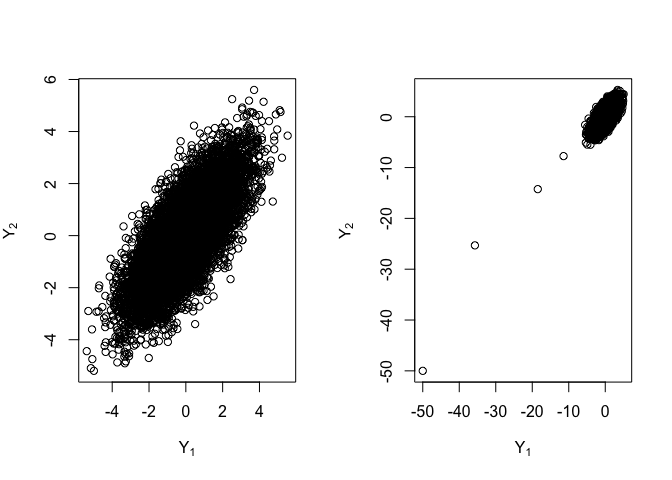
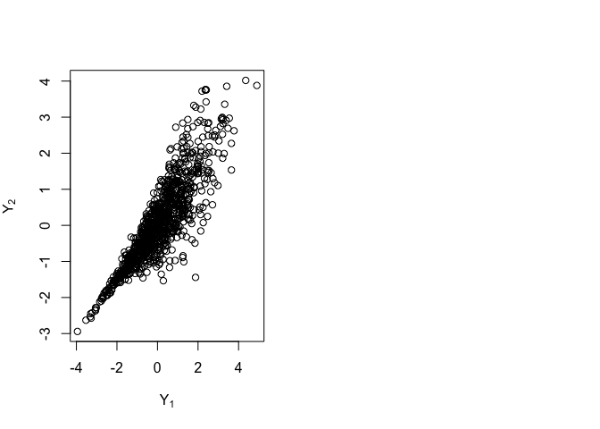

``` r
# Script: Gibbs_Sampling_Normal.R
# Description: This script implements Gibbs sampling for a bivariate normal distribution.

# Flag to control PDF generation
generate_pdf <- FALSE  # Set to TRUE to save plots

# Function to perform Gibbs sampling
gibbs_sampler <- function(n_iter, init_y, custom_sd = FALSE) {
  Y <- matrix(NA, n_iter, 2)
  Y[1, ] <- init_y
  
  for (i in 2:n_iter) {
    for (j in 1:2) {
      if (j == 1) {
        Y[i, j] <- rnorm(1, mean = 0.75 * Y[i - 1, 2])
      } else {
        if (custom_sd) {
          Y[i, j] <- rnorm(1, mean = 0.75 * Y[i, 1], 
                           sd = exp(Y[i, 1]) / (1 + exp(Y[i, 1])))
        } else {
          Y[i, j] <- rnorm(1, mean = 0.75 * Y[i, 1])
        }
      }
    }
  }
  
  return(Y)
}

# First Gibbs sampling run
Y1 <- gibbs_sampler(10000, c(0, 0))

# Second Gibbs sampling run with different initialization
Y2 <- gibbs_sampler(10000, c(-50, -50))

# Plot 1: First Gibbs sampling run
if (generate_pdf) pdf("Gibbs-Normal.pdf", width = 8, height = 4)
par(mfrow = c(1, 2))
plot(Y1, ylab = expression(Y[2]), xlab = expression(Y[1]))
plot(Y2, ylab = expression(Y[2]), xlab = expression(Y[1]))
```

<!-- -->

``` r
if (generate_pdf) dev.off()

# Third Gibbs sampling run with different variance in second variable
Y3 <- gibbs_sampler(1000, c(0, 0), custom_sd = TRUE)

# Plot 2: Gibbs sampling with different variance
if (generate_pdf) pdf("Gibbs-Normal-1.pdf", width = 4, height = 4)
plot(Y3, ylab = expression(Y[2]), xlab = expression(Y[1]))
if (generate_pdf) dev.off()
```

<!-- -->
