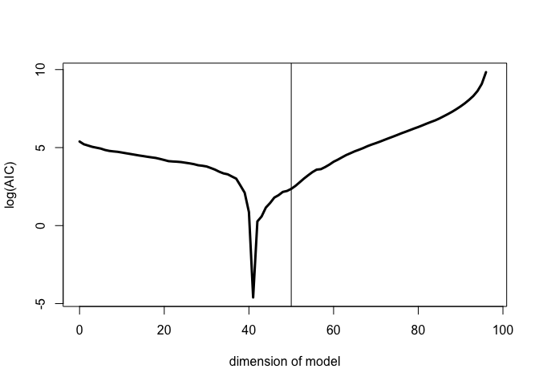
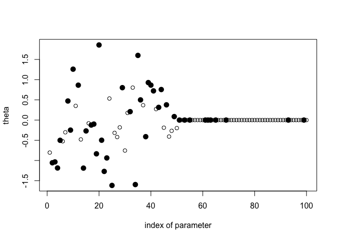

``` r
# Script: AIC_Large_Sample_Selection.R
# Description: This script performs model selection using AIC for large sample sizes.

# Load necessary library
library(gamlr)
```

    ## Loading required package: Matrix

``` r
# Set seed for reproducibility
set.seed(1)

# Define number of observations and predictors
n <- 100
K <- 100

# Generate data matrix and true coefficients
X <- matrix(rnorm(n * K), nrow = n)
theta <- matrix(c(rnorm(K / 2), rep(0, K / 2)))

# Generate response variable
Y <- X %*% theta + rnorm(n, sd = 1)

# Fit initial model with intercept only
mod <- lm(Y ~ 1)
aic <- AICc(mod)  # Corrected AIC

# Maximum model dimension
Kmax <- min((n - 1), (K - 2))
models <- matrix(0, Kmax, K)
models[1, ] <- 0

# Flag to control PDF generation
generate_pdf <- FALSE  # Set to TRUE to save plots

# Forward selection using AIC
for (k in 2:Kmax) {
  print(k)
  index <- 1:K
  index.in <- index[models[k - 1, ] == 1]
  index.out <- index[models[k - 1, ] == 0]
  aic.loop <- c()
  
  # Compute AIC for candidate models
  for (j in seq_along(index.out)) {
    index.mod <- c(index.in, index.out[j])
    aic.loop <- c(aic.loop, AICc(lm(Y ~ X[, index.mod])))
  }
  
  # Select the best predictor
  index.select <- index.out[aic.loop == min(aic.loop)]
  models[k:Kmax, index.select] <- 1
  aic <- c(aic, min(aic.loop))
}
```

    ## [1] 2
    ## [1] 3
    ## [1] 4
    ## [1] 5
    ## [1] 6
    ## [1] 7
    ## [1] 8
    ## [1] 9
    ## [1] 10
    ## [1] 11
    ## [1] 12
    ## [1] 13
    ## [1] 14
    ## [1] 15
    ## [1] 16
    ## [1] 17
    ## [1] 18
    ## [1] 19
    ## [1] 20
    ## [1] 21
    ## [1] 22
    ## [1] 23
    ## [1] 24
    ## [1] 25
    ## [1] 26
    ## [1] 27
    ## [1] 28
    ## [1] 29
    ## [1] 30
    ## [1] 31
    ## [1] 32
    ## [1] 33
    ## [1] 34
    ## [1] 35
    ## [1] 36
    ## [1] 37
    ## [1] 38
    ## [1] 39
    ## [1] 40
    ## [1] 41
    ## [1] 42
    ## [1] 43
    ## [1] 44
    ## [1] 45
    ## [1] 46
    ## [1] 47
    ## [1] 48
    ## [1] 49
    ## [1] 50
    ## [1] 51
    ## [1] 52
    ## [1] 53
    ## [1] 54
    ## [1] 55
    ## [1] 56
    ## [1] 57
    ## [1] 58
    ## [1] 59
    ## [1] 60
    ## [1] 61
    ## [1] 62
    ## [1] 63
    ## [1] 64
    ## [1] 65
    ## [1] 66
    ## [1] 67
    ## [1] 68
    ## [1] 69
    ## [1] 70
    ## [1] 71
    ## [1] 72
    ## [1] 73
    ## [1] 74
    ## [1] 75
    ## [1] 76
    ## [1] 77
    ## [1] 78
    ## [1] 79
    ## [1] 80
    ## [1] 81
    ## [1] 82
    ## [1] 83
    ## [1] 84
    ## [1] 85
    ## [1] 86
    ## [1] 87
    ## [1] 88
    ## [1] 89
    ## [1] 90
    ## [1] 91
    ## [1] 92
    ## [1] 93
    ## [1] 94
    ## [1] 95
    ## [1] 96
    ## [1] 97
    ## [1] 98

``` r
# Function to generate AIC plots
plot_aic <- function(filename) {
  if (generate_pdf) pdf(filename, width = 5, height = 5)
  plot((0:(length(aic) - 1)), log(aic - min(aic) + 0.01),
       xlab = "dimension of model", ylab = "log(AIC)",
       type = "l", lwd = 3)
  abline(v = 50)
  if (generate_pdf) dev.off()
}

# Function to plot estimated parameters
plot_estimates <- function(filename) {
  if (generate_pdf) pdf(filename, width = 5, height = 3)
  plot(theta, xlab = "index of parameter")
  index.best <- models[aic == min(aic), ]
  index.best <- (1:K)[index.best == 1]
  points(index.best, theta[index.best], pch = 16, cex = 1.5)
  if (generate_pdf) dev.off()
}

# Generate AIC and parameter estimate plots
plot_aic("plot-aic-small-n.pdf")
```

<!-- -->

``` r
plot_estimates("plot-aic-est-small-n.pdf")
```

<!-- -->

``` r
plot_aic("plot-aic-c-small-n.pdf")
```

<!-- -->

``` r
plot_estimates("plot-aic-c-est-small-n.pdf")
```

<!-- -->
