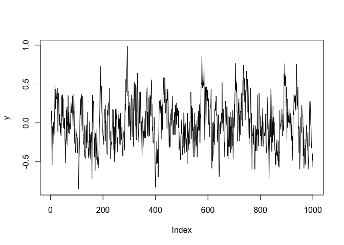
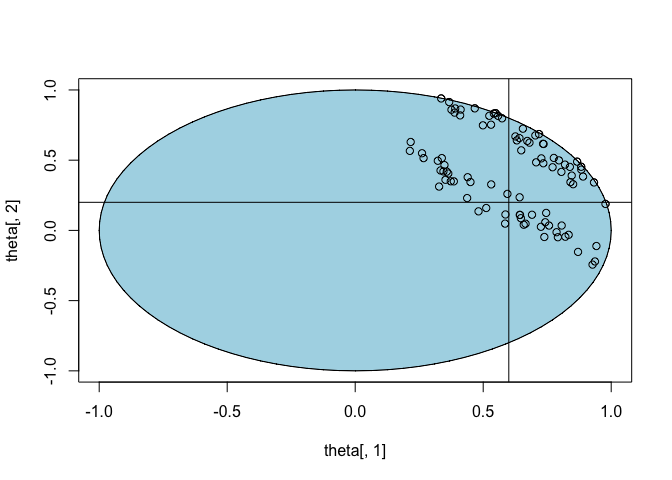
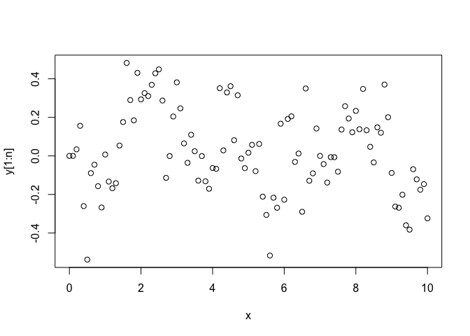
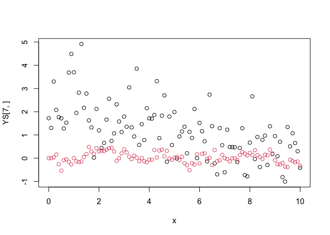

``` r
x = seq(0,10,by=0.1)
n = length(x)
y = rnorm(n, mean=x , sd=1 )
T = 1000
rho1 = 0.6
rho2 = 0.2
y = (c( 0 , 0))
for ( i in 3:T)
{
  y = c(y, rho1 * y[i-1] + rho2 * y[i-2] + rnorm(1,sd=0.2))
}
plot(y , type="l")
```

<!-- -->

``` r
af = c(acf(y, plot=FALSE)$acf)

theta = c()
YS = c()
dd = c()

for (j in 1:1000 )
{
  bool = FALSE
  while(bool == FALSE)
  {
      rho1s = -1+ 2 * runif(1)
      rho2s = -1 + 2* runif(1)
      bool = ( rho1s^2 + rho2s^2 < 1)
  }
  sigs = 0.2 #runif(1)
  ys = c(0,0)
  for ( i in 3:T)
  {
    ys = c(ys, rho1s * ys[i-1] + rho2s * ys[i-2] + rnorm(1,sd=sigs))
  }
  afs = c(acf(ys, plot=FALSE)$acf)
  d = max((afs[1:15]-af[1:15])^2)
#  d = mean( ( y - ys)^2)
  if (d < 0.05)
  {
    print(j)
    YS = rbind(YS, t(ys))
    theta = rbind(theta, c(rho1s, rho2s, sigs, d))
  }
  dd = c(dd,d)
}
```

    ## [1] 18
    ## [1] 22
    ## [1] 23
    ## [1] 48
    ## [1] 50
    ## [1] 52
    ## [1] 77
    ## [1] 95
    ## [1] 123
    ## [1] 142
    ## [1] 151
    ## [1] 176
    ## [1] 189
    ## [1] 198
    ## [1] 229
    ## [1] 251
    ## [1] 255
    ## [1] 260
    ## [1] 278
    ## [1] 291
    ## [1] 349
    ## [1] 352
    ## [1] 372
    ## [1] 375
    ## [1] 376
    ## [1] 378
    ## [1] 388
    ## [1] 399
    ## [1] 405
    ## [1] 410
    ## [1] 420
    ## [1] 432
    ## [1] 441
    ## [1] 443
    ## [1] 463
    ## [1] 470
    ## [1] 478
    ## [1] 480
    ## [1] 495
    ## [1] 496
    ## [1] 504
    ## [1] 510
    ## [1] 514
    ## [1] 522
    ## [1] 533
    ## [1] 572
    ## [1] 581
    ## [1] 590
    ## [1] 597
    ## [1] 626
    ## [1] 630
    ## [1] 641
    ## [1] 650
    ## [1] 659
    ## [1] 662
    ## [1] 672
    ## [1] 680
    ## [1] 684
    ## [1] 693
    ## [1] 699
    ## [1] 702
    ## [1] 727
    ## [1] 746
    ## [1] 764
    ## [1] 767
    ## [1] 790
    ## [1] 795
    ## [1] 802
    ## [1] 804
    ## [1] 806
    ## [1] 816
    ## [1] 822
    ## [1] 824
    ## [1] 828
    ## [1] 845
    ## [1] 855
    ## [1] 856
    ## [1] 867
    ## [1] 873
    ## [1] 900
    ## [1] 902
    ## [1] 916
    ## [1] 923
    ## [1] 928
    ## [1] 937
    ## [1] 961
    ## [1] 962
    ## [1] 995
    ## [1] 1000

``` r
plot(theta[,1], theta[,2], ylim=c(-1,1), xlim=c(-1,1))
px = sin(seq(0,2,by=0.01)*2*pi)
py = cos(seq(0,2,by=0.01)*2*pi)
polygon(px,py, col="lightblue")
points(theta[,1], theta[,2])
abline(v=rho1)
abline(rho2,0)
```

<!-- -->

``` r
plot(x,y[1:n])
```

<!-- -->

``` r
sig.s = var(lm(y[1:n]~x)$residual)


dd =c()
YS = c()
theta = c()
dd = c()
for( i in 1:10000)

{
  sigs = 1 # exp(rnorm(1,sd=1))
  beta0s = rnorm(1, sd=3)
  beta1s = rnorm(1, sd=3)
  ys = rnorm( n, mean= beta0s + x * beta1s, sd=sigs)
  mods = fitted(lm(ys ~ x))
  d = abs( mean( (y[1:n] - mods)^2))
  if (d < 2)

  {
    YS = rbind(YS, t(ys))
    theta = rbind(theta, c(beta0s, beta1s, sigs, d))
  }
  dd = c(dd,d)
}

plot(x,YS[7,])   
points(x,y[1:n],col=2)
```

<!-- -->
