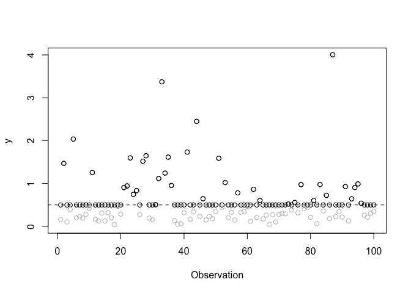

``` r
# Script: Censored_Regression_Example.R
# Description: This script demonstrates censored regression using the 
# censReg package. It visualizes censored data and performs a simple 
# censored regression analysis.

# Load the required library
library(censReg)
```

    ## Loading required package: maxLik

    ## Loading required package: miscTools

    ## 
    ## Please cite the 'maxLik' package as:
    ## Henningsen, Arne and Toomet, Ott (2011). maxLik: A package for maximum likelihood estimation in R. Computational Statistics 26(3), 443-458. DOI 10.1007/s00180-010-0217-1.
    ## 
    ## If you have questions, suggestions, or comments regarding the 'maxLik' package, please use a forum or 'tracker' at maxLik's R-Forge site:
    ## https://r-forge.r-project.org/projects/maxlik/

    ## 
    ## Please cite the 'censReg' package as:
    ## Henningsen, Arne (2017). censReg: Censored Regression (Tobit) Models. R package version 0.5. http://CRAN.R-Project.org/package=censReg.
    ## 
    ## If you have questions, suggestions, or comments regarding the 'censReg' package, please use a forum or 'tracker' at the R-Forge site of the 'sampleSelection' project:
    ## https://r-forge.r-project.org/projects/sampleselection/

``` r
# Flag to control PDF generation
generate_pdf <- FALSE  # Set to TRUE to generate PDF files

# Set parameters and seed
n <- 100  # Number of observations
set.seed(5)  # Set seed for reproducibility

# Generate data
y <- exp(rnorm(n, mean = -1))  # Uncensored data
yc <- y  # Censored version of the data
yc[y <= 0.5] <- 0.5  # Apply left censoring at 0.5
logyc <- log(yc)  # Log-transformed censored data

# Plot the censored data
if (generate_pdf) pdf("plot-cens.pdf", width = 5, height = 5)
plot(yc, ylim = c(0, 4), ylab = "y", xlab = "Observation")
abline(h = 0.5, lty = 2)  # Horizontal line indicating censoring threshold
points((1:n)[y > 0.5], y[y > 0.5])  # Points for uncensored observations
points((1:n)[y <= 0.5], y[y <= 0.5], col = "grey")  # Points for censored observations
```

<!-- -->

``` r
if (generate_pdf) dev.off()

# Summary statistics for log-transformed data
cat("Mean of log(y):", mean(log(y)), "\n")
```

    ## Mean of log(y): -0.968365

``` r
cat("Variance of log(y):", var(log(y)), "\n")
```

    ## Variance of log(y): 0.8935626

``` r
cat("Mean of log(yc):", mean(log(yc)), "\n")
```

    ## Mean of log(yc): -0.4236955

``` r
cat("Variance of log(yc):", var(log(yc)), "\n")
```

    ## Variance of log(yc): 0.2222816

``` r
# Perform censored regression
cens_reg_result <- censReg(logyc ~ 1, left = log(0.5))  # Left-censored regression
print(summary(cens_reg_result))
```

    ## 
    ## Call:
    ## censReg(formula = logyc ~ 1, left = log(0.5))
    ## 
    ## Observations:
    ##          Total  Left-censored     Uncensored Right-censored 
    ##            100             64             36              0 
    ## 
    ## Coefficients:
    ##             Estimate Std. error t value  Pr(> t)    
    ## (Intercept) -1.04333    0.15754  -6.623 3.53e-11 ***
    ## logSigma     0.03619    0.13634   0.265    0.791    
    ## ---
    ## Signif. codes:  0 '***' 0.001 '**' 0.01 '*' 0.05 '.' 0.1 ' ' 1
    ## 
    ## Newton-Raphson maximisation, 8 iterations
    ## Return code 1: gradient close to zero (gradtol)
    ## Log-likelihood: -88.17138 on 2 Df
