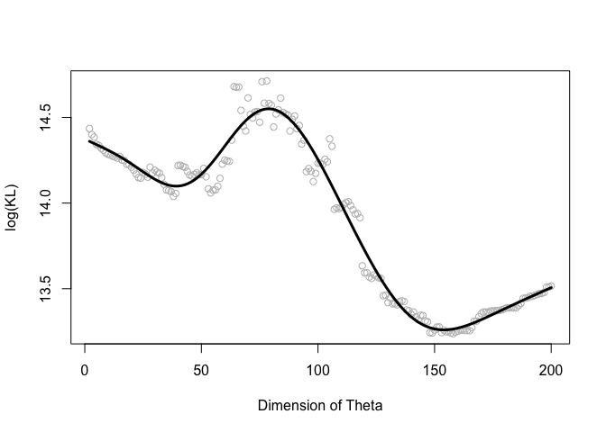
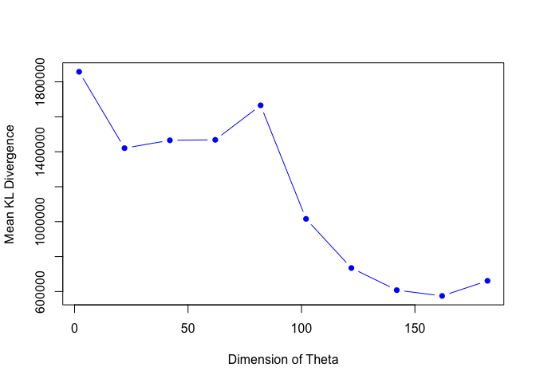

``` r
# Script: Deep_Learning_Regularization.R
# Description: This script demonstrates deep learning regularization techniques using ridge regression.

# Load necessary libraries
library(gamlr)
library(mgcv)
```

    ## Loading required package: nlme

    ## This is mgcv 1.9-3. For overview type 'help("mgcv-package")'.

``` r
# Set seed for reproducibility
set.seed(4)

# Define sample sizes
n <- 100
K <- 200

# Generate predictor matrix and coefficients
X <- matrix(rnorm(n * K), nrow = n)
theta <- matrix(c(rnorm(K)))

# Order theta by absolute magnitude (for feature selection)
oi <- order(abs(theta), decreasing = TRUE)
theta <- theta[oi]

# Generate response variable
Y <- X %*% theta + rnorm(n, sd = 1)

# Generate new dataset for evaluation
n.new <- 10000
X.new <- matrix(rnorm(n.new * K), nrow = n.new)
Y.new <- X.new %*% theta + rnorm(n.new, sd = 1)

# Initialize baseline model with intercept only
mod <- lm(Y ~ 1)

# Regularization parameter for ridge regression
gamma <- 0.5
KL <- c()

# Forward selection with ridge penalty
for (k in 2:K) {
  print(k)
  index.in <- 1:k
  X.mod <- X[, index.in]
  theta.est <- solve(t(X.mod) %*% X.mod + gamma * diag(k)) %*% t(X.mod) %*% Y
  KL <- c(KL, t(Y.new - X.new[, index.in] %*% theta.est) %*% 
            (Y.new - X.new[, index.in] %*% theta.est))
}
```

    ## [1] 2
    ## [1] 3
    ## [1] 4
    ## [1] 5
    ## [1] 6
    ## [1] 7
    ## [1] 8
    ## [1] 9
    ## [1] 10
    ## [1] 11
    ## [1] 12
    ## [1] 13
    ## [1] 14
    ## [1] 15
    ## [1] 16
    ## [1] 17
    ## [1] 18
    ## [1] 19
    ## [1] 20
    ## [1] 21
    ## [1] 22
    ## [1] 23
    ## [1] 24
    ## [1] 25
    ## [1] 26
    ## [1] 27
    ## [1] 28
    ## [1] 29
    ## [1] 30
    ## [1] 31
    ## [1] 32
    ## [1] 33
    ## [1] 34
    ## [1] 35
    ## [1] 36
    ## [1] 37
    ## [1] 38
    ## [1] 39
    ## [1] 40
    ## [1] 41
    ## [1] 42
    ## [1] 43
    ## [1] 44
    ## [1] 45
    ## [1] 46
    ## [1] 47
    ## [1] 48
    ## [1] 49
    ## [1] 50
    ## [1] 51
    ## [1] 52
    ## [1] 53
    ## [1] 54
    ## [1] 55
    ## [1] 56
    ## [1] 57
    ## [1] 58
    ## [1] 59
    ## [1] 60
    ## [1] 61
    ## [1] 62
    ## [1] 63
    ## [1] 64
    ## [1] 65
    ## [1] 66
    ## [1] 67
    ## [1] 68
    ## [1] 69
    ## [1] 70
    ## [1] 71
    ## [1] 72
    ## [1] 73
    ## [1] 74
    ## [1] 75
    ## [1] 76
    ## [1] 77
    ## [1] 78
    ## [1] 79
    ## [1] 80
    ## [1] 81
    ## [1] 82
    ## [1] 83
    ## [1] 84
    ## [1] 85
    ## [1] 86
    ## [1] 87
    ## [1] 88
    ## [1] 89
    ## [1] 90
    ## [1] 91
    ## [1] 92
    ## [1] 93
    ## [1] 94
    ## [1] 95
    ## [1] 96
    ## [1] 97
    ## [1] 98
    ## [1] 99
    ## [1] 100
    ## [1] 101
    ## [1] 102
    ## [1] 103
    ## [1] 104
    ## [1] 105
    ## [1] 106
    ## [1] 107
    ## [1] 108
    ## [1] 109
    ## [1] 110
    ## [1] 111
    ## [1] 112
    ## [1] 113
    ## [1] 114
    ## [1] 115
    ## [1] 116
    ## [1] 117
    ## [1] 118
    ## [1] 119
    ## [1] 120
    ## [1] 121
    ## [1] 122
    ## [1] 123
    ## [1] 124
    ## [1] 125
    ## [1] 126
    ## [1] 127
    ## [1] 128
    ## [1] 129
    ## [1] 130
    ## [1] 131
    ## [1] 132
    ## [1] 133
    ## [1] 134
    ## [1] 135
    ## [1] 136
    ## [1] 137
    ## [1] 138
    ## [1] 139
    ## [1] 140
    ## [1] 141
    ## [1] 142
    ## [1] 143
    ## [1] 144
    ## [1] 145
    ## [1] 146
    ## [1] 147
    ## [1] 148
    ## [1] 149
    ## [1] 150
    ## [1] 151
    ## [1] 152
    ## [1] 153
    ## [1] 154
    ## [1] 155
    ## [1] 156
    ## [1] 157
    ## [1] 158
    ## [1] 159
    ## [1] 160
    ## [1] 161
    ## [1] 162
    ## [1] 163
    ## [1] 164
    ## [1] 165
    ## [1] 166
    ## [1] 167
    ## [1] 168
    ## [1] 169
    ## [1] 170
    ## [1] 171
    ## [1] 172
    ## [1] 173
    ## [1] 174
    ## [1] 175
    ## [1] 176
    ## [1] 177
    ## [1] 178
    ## [1] 179
    ## [1] 180
    ## [1] 181
    ## [1] 182
    ## [1] 183
    ## [1] 184
    ## [1] 185
    ## [1] 186
    ## [1] 187
    ## [1] 188
    ## [1] 189
    ## [1] 190
    ## [1] 191
    ## [1] 192
    ## [1] 193
    ## [1] 194
    ## [1] 195
    ## [1] 196
    ## [1] 197
    ## [1] 198
    ## [1] 199
    ## [1] 200

``` r
# Flag to control PDF generation
generate_pdf <- FALSE  # Set to TRUE to save plots

# Plot 1: Dimension of Theta vs Log KL divergence
if (generate_pdf) pdf("deepl.pdf", width = 5, height = 5)
plot(2:K, log(KL), col = "grey", xlab = "Dimension of Theta")
xx <- 2:K
yy <- log(KL)
mm <- gam(yy ~ s(xx))
lines(2:K, fitted(mm), lwd = 3)
```

<!-- -->

``` r
if (generate_pdf) dev.off()

# Data Augmentation
X.aug <- kronecker(matrix(1, 1000, 1), X)
NN <- dim(X.aug)
X.aug <- matrix(rnorm(NN[1] * NN[2], sd = 0.1), nrow = NN[1]) + X.aug
Y.aug <- kronecker(matrix(1, 1000, 1), Y)

KL <- c()
KK <- seq(2, 200, by = 20)

# Regularization for augmented data
for (k in KK) {
  print(k)
  index.in <- 1:k
  X.mod <- X.aug[, index.in]
  theta.est <- solve(t(X.mod) %*% X.mod) %*% t(X.mod) %*% Y.aug
  KL <- c(KL, mean(t(Y.new - X.new[, index.in] %*% theta.est) %*% 
                     (Y.new - X.new[, index.in] %*% theta.est)))
}
```

    ## [1] 2
    ## [1] 22
    ## [1] 42
    ## [1] 62
    ## [1] 82
    ## [1] 102
    ## [1] 122
    ## [1] 142
    ## [1] 162
    ## [1] 182

``` r
# Plot 2: KL divergence vs Model Complexity (Augmented Data)
if (generate_pdf) pdf("deepl-aug.pdf", width = 5, height = 5)
plot(KK, KL, type = "b", pch = 16, xlab = "Dimension of Theta", 
     ylab = "Mean KL Divergence", col = "blue")
```

<!-- -->

``` r
if (generate_pdf) dev.off()

# Final Ridge Regression Estimation
theta <- solve(t(X.aug) %*% X.aug) %*% (t(X.aug) %*% Y.aug)
KL <- c(KL, t(Y.new - X.new[, 1:length(theta)] %*% theta) %*% 
          (Y.new - X.new[, 1:length(theta)] %*% theta))
```
