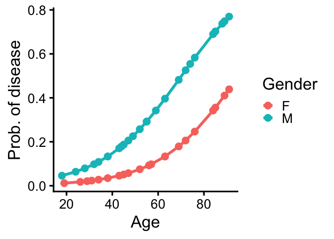

``` r
# Script: Logistic_Regression_Analysis.R
# Description: This script performs logistic regression to model disease probability 
# based on age and gender.

# Load necessary library
library(ggplot2)

# Flag to control image generation
generate_pdf <- FALSE  # Set to TRUE to save the plot

# Generate dataset
set.seed(999)
gender <- c(rep("M", 26), rep("F", 21))
age <- c(18, 24, 28, 32, 34, 38, 38, 43, 44, 45, 47, 49, 52, 55, 55, 59, 63, 69, 72, 
         74, 76, 84, 85, 88, 89, 91, 19, 26, 29, 31, 34, 38, 43, 45, 47, 52, 56, 57, 
         63, 63, 69, 72, 76, 84, 85, 89, 91)
disease <- c(0, 0, 0, 0, 1, 0, 0, 0, 0, 0, 0, 1, 0, 0, 1, 0, 0, 0, 1, 0, 1, 1, 1, 0, 1, 1, 
             0, 0, 0, 0, 0, 0, 0, 1, 0, 0, 0, 0, 0, 0, 0, 0, 0, 0, 1, 0, 1)
patients <- data.frame(age, gender, disease)

# Logistic regression model: Disease ~ Age + Gender
mod1 <- glm(data = patients, disease ~ age + gender, family = binomial)
summary(mod1)
```

    ## 
    ## Call:
    ## glm(formula = disease ~ age + gender, family = binomial, data = patients)
    ## 
    ## Coefficients:
    ##             Estimate Std. Error z value Pr(>|z|)    
    ## (Intercept) -5.53398    1.67231  -3.309 0.000936 ***
    ## age          0.05811    0.02134   2.723 0.006465 ** 
    ## genderM      1.45225    0.85218   1.704 0.088352 .  
    ## ---
    ## Signif. codes:  0 '***' 0.001 '**' 0.01 '*' 0.05 '.' 0.1 ' ' 1
    ## 
    ## (Dispersion parameter for binomial family taken to be 1)
    ## 
    ##     Null deviance: 53.402  on 46  degrees of freedom
    ## Residual deviance: 40.942  on 44  degrees of freedom
    ## AIC: 46.942
    ## 
    ## Number of Fisher Scoring iterations: 5

``` r
# Prepare new data with predicted probabilities
patients$Gender <- as.factor(patients$gender)
new_data <- patients
new_data$vs <- predict(mod1, newdata = patients, type = "response")

# Plot logistic regression results
logistic_plot <- ggplot(data = new_data, 
                        aes(x = age, y = vs, color = Gender)) +
  theme_classic(base_size = 25) +
  geom_line(data = new_data, size = 2) +
  geom_point(size = 4) +
  xlab("Age") +
  ylab("Prob. of disease")
```

    ## Warning: Using `size` aesthetic for lines was deprecated in
    ## ggplot2 3.4.0.
    ## ℹ Please use `linewidth` instead.
    ## This warning is displayed once per session.
    ## Call `lifecycle::last_lifecycle_warnings()` to see
    ## where this warning was generated.

``` r
# Save plot if enabled
if (generate_pdf) {
  ggsave("logistic_plot.png", plot = logistic_plot, width = 8, height = 8)
}

# Display 
logistic_plot
```

<!-- -->

``` r
# Print model summary
print(summary(mod1))
```

    ## 
    ## Call:
    ## glm(formula = disease ~ age + gender, family = binomial, data = patients)
    ## 
    ## Coefficients:
    ##             Estimate Std. Error z value Pr(>|z|)    
    ## (Intercept) -5.53398    1.67231  -3.309 0.000936 ***
    ## age          0.05811    0.02134   2.723 0.006465 ** 
    ## genderM      1.45225    0.85218   1.704 0.088352 .  
    ## ---
    ## Signif. codes:  0 '***' 0.001 '**' 0.01 '*' 0.05 '.' 0.1 ' ' 1
    ## 
    ## (Dispersion parameter for binomial family taken to be 1)
    ## 
    ##     Null deviance: 53.402  on 46  degrees of freedom
    ## Residual deviance: 40.942  on 44  degrees of freedom
    ## AIC: 46.942
    ## 
    ## Number of Fisher Scoring iterations: 5
