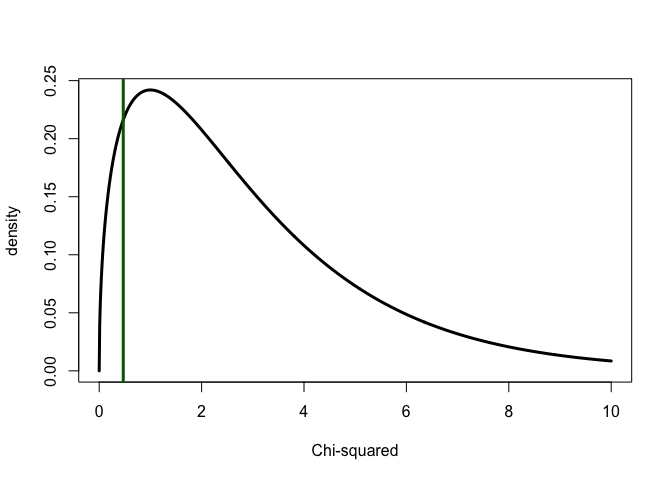
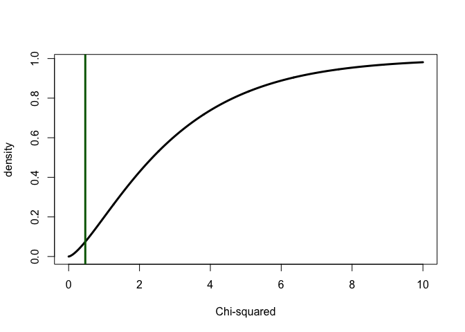

``` r
# Script: Mendel_Chi_Square_Test.R
# Description: This script performs a Chi-squared test on Mendel's data and generates plots of the Chi-squared distribution.
# Optionally, the plots can be saved as PDF files.

# Flag to control PDF generation
generate_pdf <- FALSE  # Set to TRUE to generate PDF files

# Mendel's experimental data
mendel <- c(315, 101, 108, 32)

# Total number of observations
n <- sum(mendel)

# Expected proportions under the null hypothesis (9:3:3:1 ratio)
p0 <- c(9, 3, 3, 1) / 16

# Observed proportions
ph <- mendel / n

# Observed and expected counts
obser <- mendel
expec <- sum(mendel) * p0

# Calculate the Chi-squared statistic
Chi <- sum((obser - expec)^2 / expec)

# First plot: Chi-squared density plot
x <- seq(0, 10, by = 0.01)
if (generate_pdf) pdf("plot-mendel-sri-1.pdf", width = 6, height = 4)
plot(x, dchisq(x, df = 3), type = "l", lwd = 3,
     ylab = "density", xlab = "Chi-squared")
abline(v = Chi, col = "darkgreen", lwd = 3)
```

<!-- -->

``` r
if (generate_pdf) dev.off()

# Second plot: Chi-squared cumulative distribution function (CDF)
if (generate_pdf) pdf("plot-mendel-sri-2.pdf", width = 6, height = 4)
plot(x, pchisq(x, df = 3), type = "l", lwd = 3,
     ylab = "density", xlab = "Chi-squared")
abline(v = Chi, col = "darkgreen", lwd = 3)
```

<!-- -->

``` r
if (generate_pdf) dev.off()

# Likelihood ratio test statistic for the multinomial distribution
lr <- 2 * (dmultinom(mendel, prob = ph, log = TRUE) -
             dmultinom(mendel, prob = p0, log = TRUE))

# Print the Chi-squared statistic and likelihood ratio
cat("Chi-squared statistic:", Chi, "\n")
```

    ## Chi-squared statistic: 0.470024

``` r
cat("Likelihood ratio statistic:", lr, "\n")
```

    ## Likelihood ratio statistic: 0.4754452
