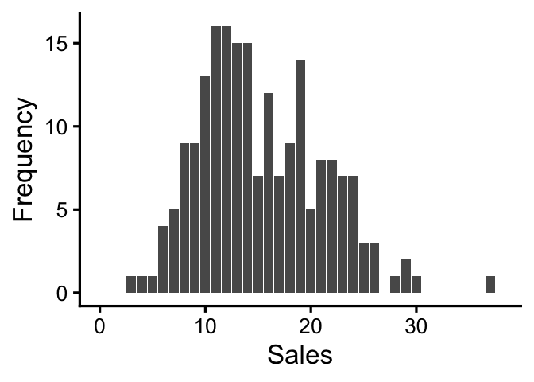

``` r
# Script: Poisson_Regression_Analysis.R
# Description: This script generates synthetic sales data and fits a Poisson regression model.

# Load necessary library
library(tidyverse)
```

    ## ── Attaching core tidyverse packages ────────────────
    ## ✔ dplyr     1.1.4     ✔ readr     2.1.6
    ## ✔ forcats   1.0.1     ✔ stringr   1.6.0
    ## ✔ lubridate 1.9.4     ✔ tibble    3.3.1
    ## ✔ purrr     1.2.1     ✔ tidyr     1.3.2
    ## ── Conflicts ─────────────── tidyverse_conflicts() ──
    ## ✖ dplyr::collapse() masks nlme::collapse()
    ## ✖ tidyr::expand()   masks Matrix::expand()
    ## ✖ tidyr::extract()  masks texreg::extract()
    ## ✖ dplyr::filter()   masks stats::filter()
    ## ✖ dplyr::lag()      masks stats::lag()
    ## ✖ purrr::lift()     masks caret::lift()
    ## ✖ tidyr::pack()     masks Matrix::pack()
    ## ✖ evir::qplot()     masks ggplot2::qplot()
    ## ✖ dplyr::select()   masks MASS::select()
    ## ✖ tidyr::unpack()   masks Matrix::unpack()
    ## ℹ Use the conflicted package (<http://conflicted.r-lib.org/>) to force all conflicts to become errors

``` r
library(mgcv)

# Set seed for reproducibility
set.seed(99)

# Flag to control image generation
generate_pdf <- FALSE  # Set to TRUE to save the plot

# Number of observations
n_obs <- 200

# Generate synthetic data
new_data <- tibble(
  review_score = round(runif(n_obs, min = 3, max = 5), 1),  # Random review scores between 3 and 5
  price = rnorm(n_obs, 70, 10),  # Random price
  promotion = sample(c("Yes", "No"), size = n_obs, replace = TRUE),  # Random promotion status
  purchases = rpois(n_obs, lambda = 7 * (review_score - 2) + ifelse(promotion == "Yes", 2, 0))  # Poisson-distributed purchases
)

# Display the first few rows of the generated data
print(head(new_data))
```

    ## # A tibble: 6 × 4
    ##   review_score price promotion purchases
    ##          <dbl> <dbl> <chr>         <int>
    ## 1          4.2  54.7 Yes              20
    ## 2          3.2  65.0 No               10
    ## 3          4.4  57.9 Yes              24
    ## 4          5    63.7 Yes              28
    ## 5          4.1  55.5 Yes              17
    ## 6          4.9  68.3 No               11

``` r
# Plot histogram of purchases
poisson_plot <- ggplot(data = new_data, aes(x = purchases)) +
  theme_classic(base_size = 25) +
  xlim(0, 38) +
  geom_bar() +
  xlab("Sales") +
  ylab("Frequency")

# Save plot if enabled
if (generate_pdf) {
  ggsave("poisson_plot.png", plot = poisson_plot, width = 8, height = 8)
}

# Display the plot
poisson_plot
```

<!-- -->

``` r
# Fit Poisson regression model
mod <- gam(data = new_data, family = poisson(link = "log"), 
           formula = purchases ~ review_score + promotion + price)

# Print model summary
print(summary(mod))
```

    ## 
    ## Family: poisson 
    ## Link function: log 
    ## 
    ## Formula:
    ## purchases ~ review_score + promotion + price
    ## 
    ## Parametric coefficients:
    ##               Estimate Std. Error z value Pr(>|z|)    
    ## (Intercept)  0.6420874  0.1733861   3.703 0.000213 ***
    ## review_score 0.4732526  0.0336452  14.066  < 2e-16 ***
    ## promotionYes 0.1658749  0.0367438   4.514 6.35e-06 ***
    ## price        0.0006717  0.0016842   0.399 0.690022    
    ## ---
    ## Signif. codes:  0 '***' 0.001 '**' 0.01 '*' 0.05 '.' 0.1 ' ' 1
    ## 
    ## 
    ## R-sq.(adj) =  0.519   Deviance explained = 53.9%
    ## UBRE = 0.041898  Scale est. = 1         n = 200
