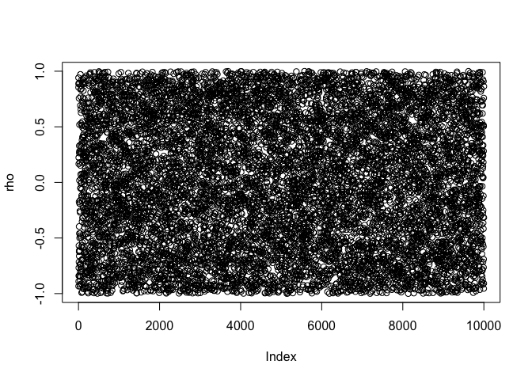
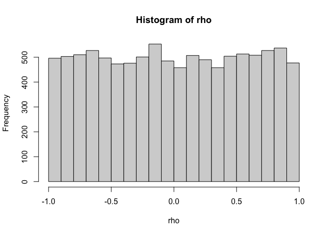
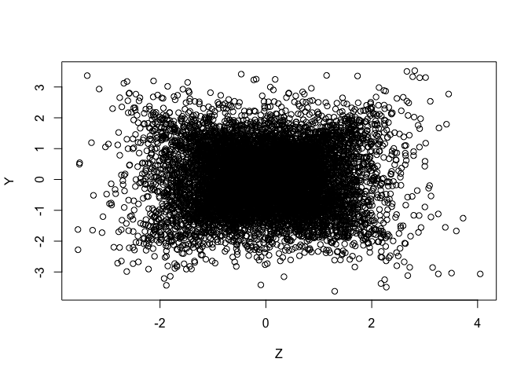
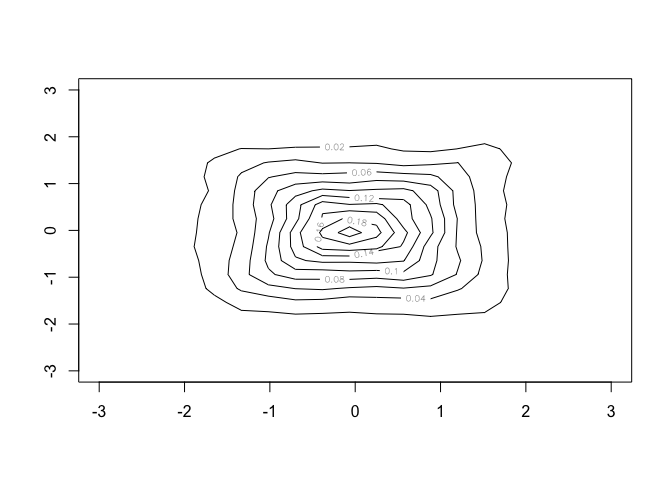
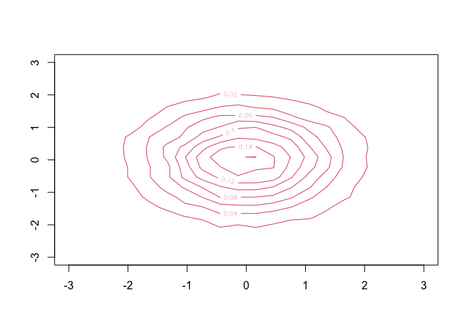

``` r
# Script: Simulate_Unknown_Input.R
# Description: This script simulates bivariate normal distributions with varying correlation.

# Load required library
library(MASS)

# Flag to control PDF generation
generate_pdf <- FALSE  # Set to TRUE to save plots

# Number of samples
N <- 10000

# Generate correlation values
rho <- 1 - 2 * runif(N)

# Plot 1: Correlation values
if (generate_pdf) pdf("plot-rho.pdf", height = 4, width = 4)
plot(rho, ylab = "rho", xlab = "Index")
```

<!-- -->

``` r
if (generate_pdf) dev.off()

# Plot 2: Histogram of correlation values
if (generate_pdf) pdf("hist-rho.pdf", height = 4, width = 4)
hist(rho, main = "Histogram of rho", xlab = "rho")
```

<!-- -->

``` r
if (generate_pdf) dev.off()

# Generate bivariate normal data with varying correlation
y <- matrix(nrow = N, ncol = 2)
for (i in 1:N) {
  Sigma <- rbind(c(1, rho[i]), c(rho[i], 1))
  y[i, ] <- mvrnorm(n = 1, mu = c(0, 0), Sigma = Sigma)
}

# Generate bivariate normal data with mean correlation
Sigma_mean <- rbind(c(1, mean(rho)), c(mean(rho), 1))
ys <- mvrnorm(n = N, mu = c(0, 0), Sigma = Sigma_mean)

# Plot 3: Scatter plot of simulated data
if (generate_pdf) pdf("plot-bi-1.pdf", height = 4, width = 4)
plot(y, ylab = "Y", xlab = "Z")
```

<!-- -->

``` r
if (generate_pdf) dev.off()

# Plot 4: Contour plot of simulated data density
if (generate_pdf) pdf("plot-bi-2.pdf", height = 4, width = 4)
contour(kde2d(y[, 1], y[, 2]), ylim = c(-3, 3), xlim = c(-3, 3))
```

<!-- -->

``` r
if (generate_pdf) dev.off()

# Overlay contour plot of second dataset
if (generate_pdf) pdf("plot-bi-3.pdf", height = 4, width = 4)
contour(kde2d(ys[, 1], ys[, 2]), ylim = c(-3, 3), xlim = c(-3, 3), col = 2)
```

<!-- -->

``` r
if (generate_pdf) dev.off()
```
