``` r
# Script: Time_Series_Analysis.R
# Description: This script analyzes global temperature trends, DAX stock prices,
# and time series models using GAM, ACF, AR, and MA models.

# Load necessary libraries
library(readxl)
library(mgcv)

# Flag to control PDF generation
generate_pdf <- FALSE  # Set to TRUE to save plots

# Load global temperature data
data <- read.csv("data/temperature.csv", sep = ",", dec = ".")
data <- data[data$Entity == "Global", ]
data$temp <- data[, 4]

# Plot 1: Global temperature trend
if (generate_pdf) pdf("plot-ts-1-oben.pdf", height = 5, width = 7)
plot(data$Year, data$temp, type = "l", 
     ylab = "Temperature [Celsius]", xlab = "Year")
mod <- gam(temp ~ s(Year), data = data)
lines(data$Year, fitted(mod))
```

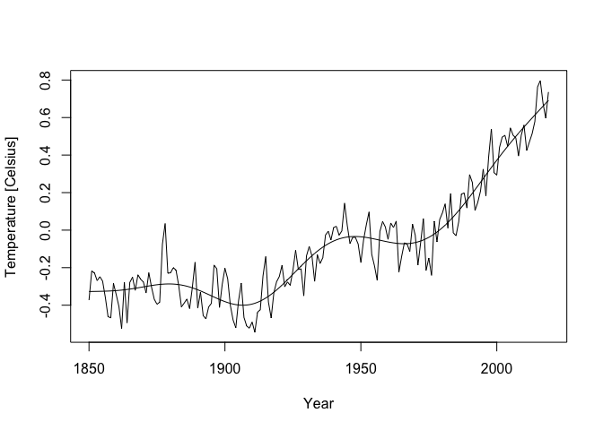<!-- -->

``` r
if (generate_pdf) dev.off()

# Compute residuals
data$res <- data$temp - fitted(mod)

# Plot 2: Residuals of temperature trend
if (generate_pdf) pdf("plot-ts-1-unten.pdf", height = 5, width = 7)
plot(data$Year, data$res, type = "l", 
     ylab = "Residual Temperature [Celsius]", xlab = "Year")
```

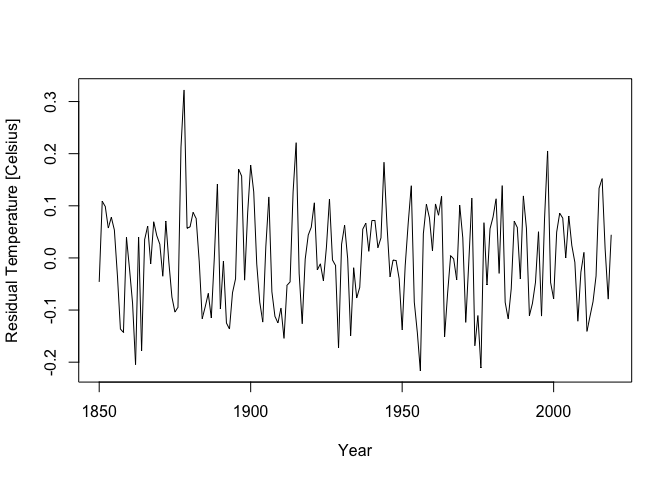<!-- -->

``` r
if (generate_pdf) dev.off()

# Plot 3: ACF of temperature residuals
if (generate_pdf) pdf("plot-ts-acf-1.pdf", height = 5, width = 7)
AA <- acf(data$res, lag.max = 10, plot = FALSE)
plot(AA, ylab = "Autocorrelation", xlab = "Lag", main = "Yearly Temperature")
```

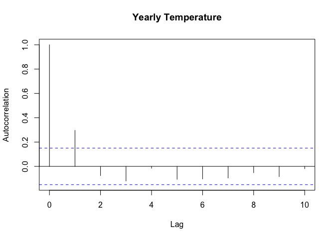<!-- -->

``` r
if (generate_pdf) dev.off()

# Load DAX stock market data
data <- read.csv("data/DAX-2.csv", dec = ",", sep = ";", header = TRUE)
data$time <- strptime(data$Datum, format = "%d.%m.%y")

# Plot 4: DAX stock market high prices over time
if (generate_pdf) pdf("plot-ts-2-oben.pdf", height = 5, width = 7)
plot(data$time, data$Hoch, type = "l", xlab = "Time", ylab = "DAX")
```

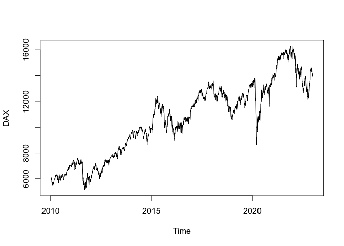<!-- -->

``` r
if (generate_pdf) dev.off()

# Compute log returns
N <- nrow(data)
data$logreturn <- c(NA, log(data$Hoch[2:N] / data$Hoch[1:(N - 1)]))

# Plot 5: Log returns of DAX
if (generate_pdf) pdf("plot-ts-2-unten.pdf", height = 5, width = 7)
plot(data$time, data$logreturn, type = "l", xlab = "Time", ylab = "Log Return")
```

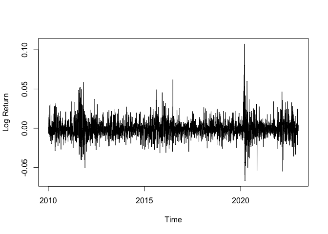<!-- -->

``` r
if (generate_pdf) dev.off()

# Plot 6: ACF of log returns
if (generate_pdf) pdf("plot-ts-acf-2.pdf", height = 5, width = 7)
AA <- acf(na.omit(data$logreturn), lag.max = 10, plot = FALSE)
plot(AA, xlim = c(0, 10), xlab = "Lag", ylab = "Autocorrelation", main = "Log Return DAX")
```

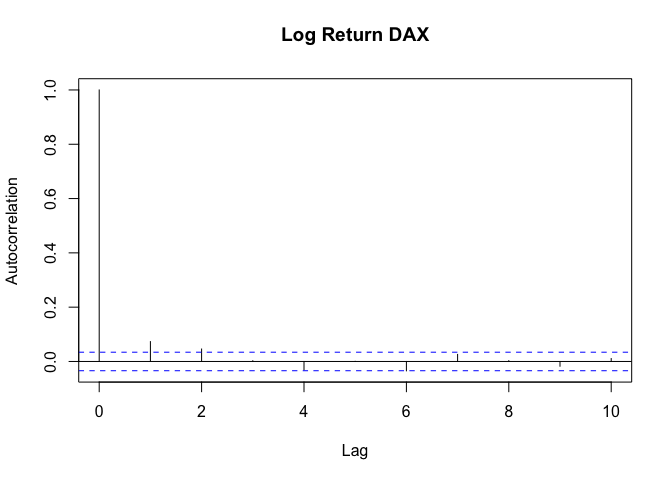<!-- -->

``` r
if (generate_pdf) dev.off()

# Load temperature data for Augsburg
data <- read.csv("data/temperatur-augsburg.csv", sep = ";")
data$time <- strptime(data$MESS_DATUM, format = "%Y%m%d")
data$temp <- data$V_TE005M

# Handle missing values in temperature
index <- which(data$temp < -50)
for (i in index) {
  data$temp[i] <- data$temp[i - 1]
}

# Trim dataset
nn <- 18619
data <- data[nn:N, ]
data$yday <- as.numeric(format(data$time, "%j"))

# Plot 7: Augsburg temperature trends
if (generate_pdf) pdf("plot-ts-3-oben.pdf", height = 5, width = 7)
plot(data$time, data$temp, type = "l", xlab = "Time", ylab = "Temperature [Celsius]")
```

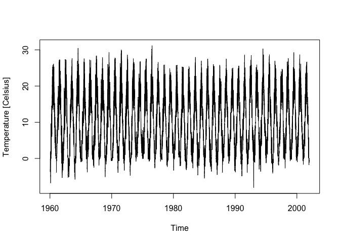<!-- -->

``` r
if (generate_pdf) dev.off()

# Fit GAM model for seasonal trend
mod <- gam(temp ~ s(yday, bs = "cc"), data = data)
data$res <- data$temp - fitted(mod)

# Plot 8: Detrended temperature
if (generate_pdf) pdf("plot-ts-3-unten.pdf", height = 5, width = 7)
plot(data$time, data$res, type = "l", xlab = "Time", ylab = "Detrended Temperature [Celsius]")
```

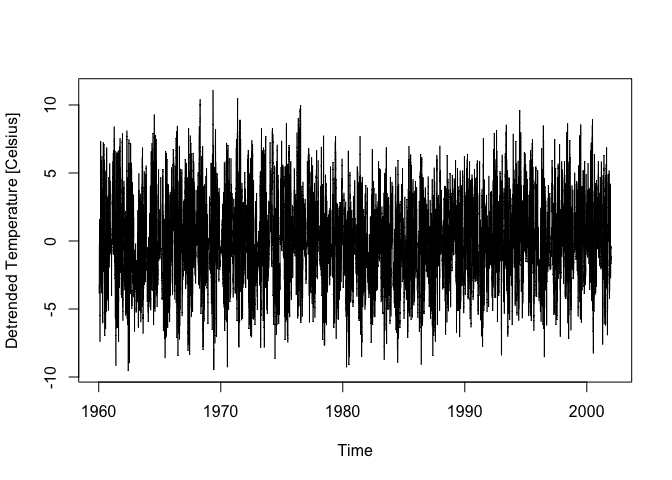<!-- -->

``` r
if (generate_pdf) dev.off()

# Plot 9: ACF of temperature residuals
if (generate_pdf) pdf("plot-ts-acf-3.pdf", height = 5, width = 7)
AA <- acf(na.omit(data$res), lag.max = 10, plot = FALSE)
plot(AA, xlim = c(0, 10), xlab = "Lag", ylab = "Autocorrelation", main = "Temperature")
```

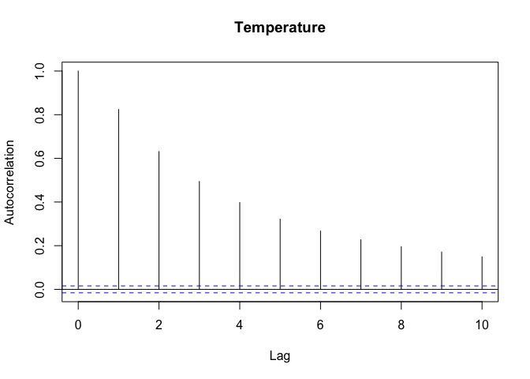<!-- -->

``` r
if (generate_pdf) dev.off()

# Simulating AR and MA processes
T <- 200

# AR models
ar_vals <- c(0.9, 0.0001, -0.9)
for (ar in ar_vals) {
  Y <- arima.sim(n = T, list(ar = ar), sd = 1)
  if (generate_pdf) pdf(paste0("plot-ts-AR-", which(ar_vals == ar), ".pdf"), height = 5, width = 7)
  plot(Y, xlab = "Time", main = paste("AR(", ar, ") process"))
  if (generate_pdf) dev.off()
}
```

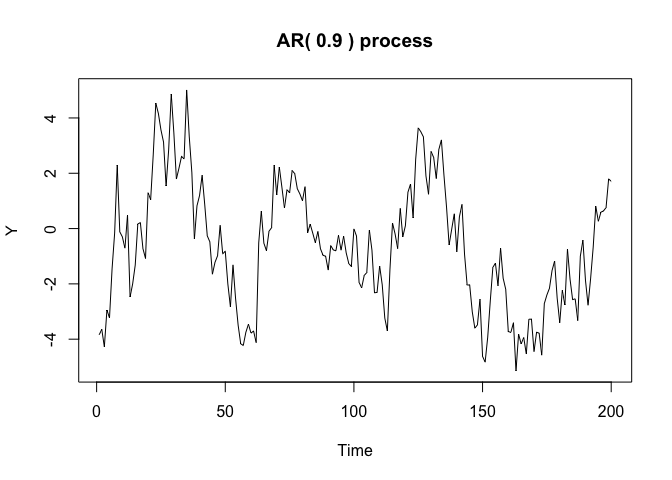<!-- -->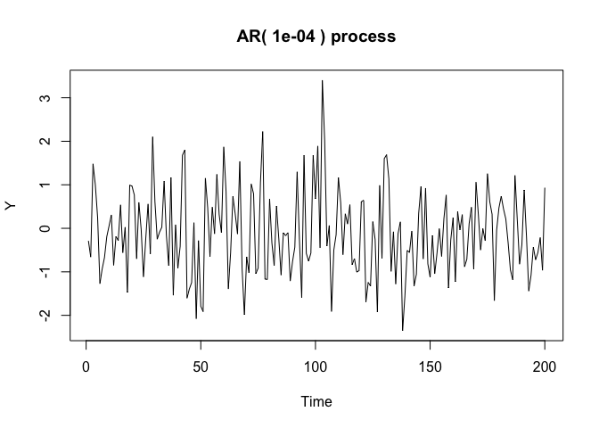<!-- -->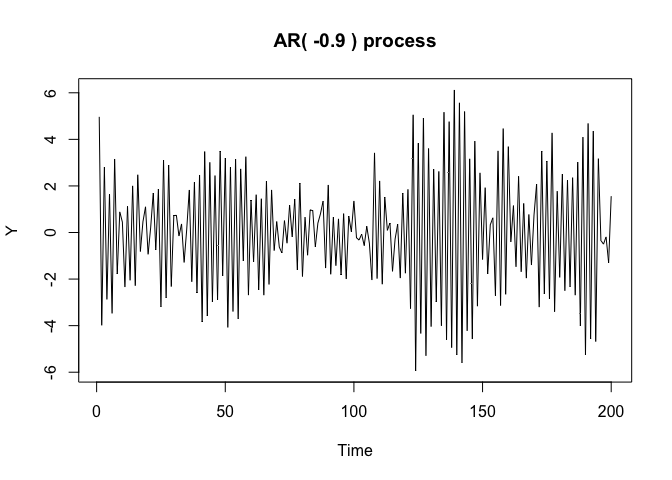<!-- -->

``` r
# Exploding AR process
Y <- numeric(T)
for (i in 2:T) {
  Y[i] <- 1.02 * Y[i - 1] + rnorm(1, sd = 1)
}
if (generate_pdf) pdf("plot-ts-explode-AR.pdf", height = 5, width = 7)
plot(Y, xlab = "Time", main = "Autocorrelation > 1", type = "l")
```

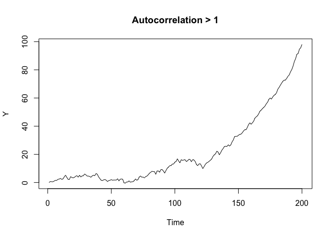<!-- -->

``` r
if (generate_pdf) dev.off()

# MA models
ma_vals <- c(0.9, -0.9)
for (ma in ma_vals) {
  Y <- arima.sim(n = T, list(ma = ma), sd = 1)
  if (generate_pdf) pdf(paste0("plot-ts-MA-", which(ma_vals == ma), ".pdf"), height = 5, width = 7)
  plot(Y, xlab = "Time", main = paste("MA(", ma, ") process"))
  if (generate_pdf) dev.off()
}
```

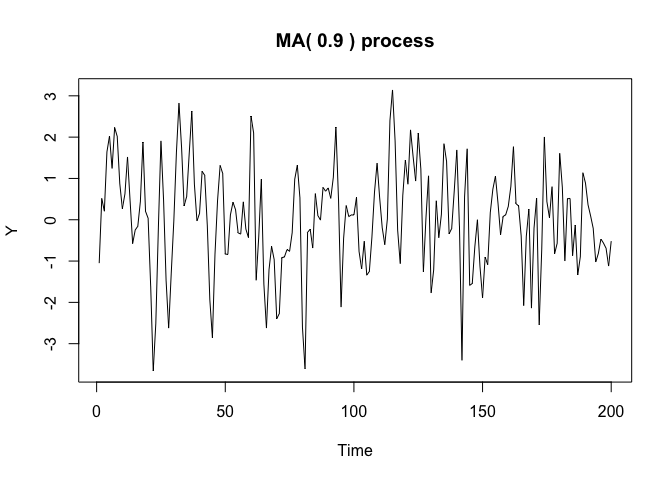<!-- -->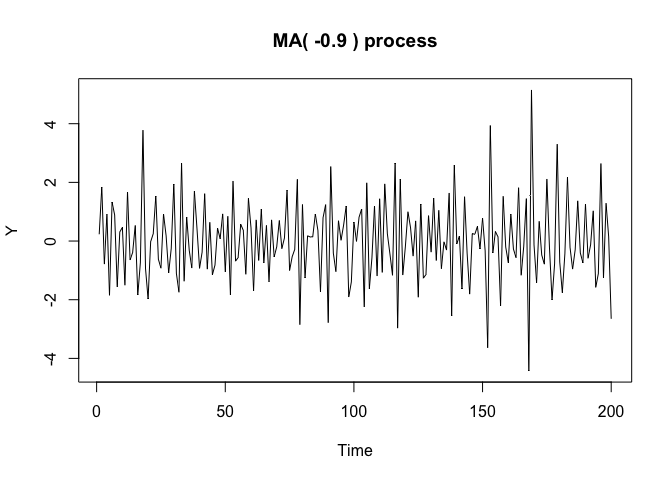<!-- -->

``` r
# AR(3) process
set.seed(1)
Y <- arima.sim(n = T, list(ar = c(0.5, 0.2, 0.2)), sd = 1)
if (generate_pdf) pdf("plot-ts-pacf-1.pdf", height = 5, width = 7)
plot(Y, xlab = "Time", main = "AR(3) process")
```

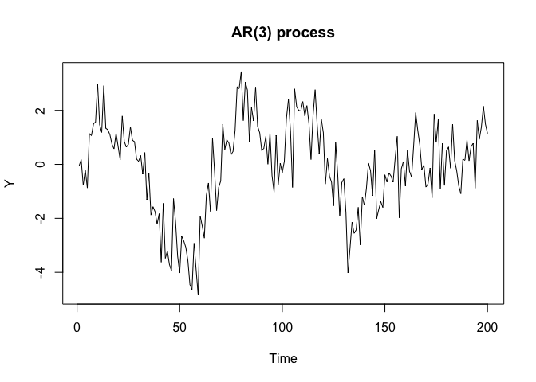<!-- -->

``` r
if (generate_pdf) dev.off()

# ACF and PACF plots
if (generate_pdf) {
  pdf("plot-ts-pacf-2.pdf", height = 5, width = 7)
  plot(acf(Y, lag.max = 15, plot = FALSE), xlim = c(0, 15), xlab = "Lag", ylab = "Autocorrelation")
  dev.off()
  
  pdf("plot-ts-pacf-3.pdf", height = 5, width = 7)
  plot(pacf(Y, lag.max = 15, plot = FALSE), xlim = c(0, 15), xlab = "Lag", ylab = "Partial Autocorrelation")
  dev.off()
}
```
